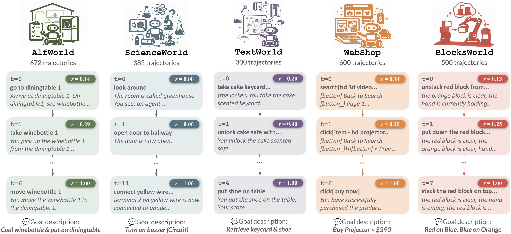
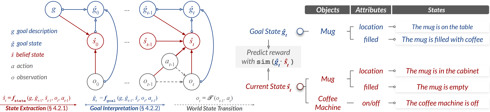

<div align="center">

# Reward Prediction with Factorized World States

<p>
  <a href="https://yijunshens.github.io/">Yijun Shen</a>*  &nbsp;&nbsp;&nbsp;&nbsp; 
  <a href="https://chendelong.world/">Delong Chen</a>*  &nbsp;&nbsp;&nbsp;&nbsp;
</p>
<p>
  <a href="https://www.semanticscholar.org/author/Xianming-Hu/2276742198">Xianming Hu</a>  &nbsp;&nbsp;&nbsp;&nbsp;
  <a href="https://openreview.net/profile?id=~Jiaming_Mi1">Jiaming Mi</a>  &nbsp;&nbsp;&nbsp;&nbsp;
  <a href="https://openreview.net/profile?id=~Hongbo_Zhao7">Hongbo Zhao</a>  &nbsp;&nbsp;&nbsp;&nbsp;
  <a href="https://faculty.ecnu.edu.cn/_s16/zk2/main.psp">Kai Zhang</a> ✉  &nbsp;&nbsp;&nbsp;&nbsp;
  <a href="https://scholar.google.com/citations?hl=en&user=QEMJWzEAAAAJ">Pascale Fung</a> 
</p>

<p>
  * <i>Equal Contribution</i> &nbsp;&nbsp;&nbsp;&nbsp; ✉ <i>Corresponding Author</i>
</p>

**[🔗 Project Website](https://statefactory.github.io)** | **[📄 Read the Paper](#)** | **[🤗 Download Benchmark](https://huggingface.co/datasets/YijunShen/RewardPrediction)**

</div>

---

## 📄 Abstract
Agents must infer action outcomes and select actions that maximize a reward signal indicating how close the goal is to being reached. Supervised learning of reward models could introduce biases inherent to training data, limiting generalization to novel goals and environments. In this paper, we investigate whether well-defined world state representations alone can enable accurate reward prediction across domains.

To address this, we introduce **StateFactory**, a factorized representation method that transforms unstructured observations into a hierarchical object-attribute structure using language models. This structured representation allows rewards to be estimated naturally as the semantic similarity between the current state and the goal state under hierarchical constraint. Overall, the compact representation structure induced by StateFactory enables strong reward generalization capabilities.

We evaluate on **RewardPrediction**, a new benchmark dataset spanning five diverse domains and comprising 2,454 unique action-observation trajectories with step-wise ground-truth rewards. Our method shows promising zero-shot results against both **VLWM-critic** and **LLM-as-a-Judge** reward models, achieving 60% and 8% lower EPIC distance, respectively. Furthermore, this superior reward quality successfully translates into improved agent planning performance, yielding success rate gains of **+21.64% on AlfWorld** and **+12.40% on ScienceWorld** over reactive system-1 policies and enhancing system-2 agent planning.

---

## 🌟 The RewardPrediction Benchmark



The **RewardPrediction** benchmark is designed to evaluate fine-grained, step-wise reward prediction across five diverse text-based environments: **AlfWorld, ScienceWorld, TextWorld, WebShop, and BlocksWorld**. It comprises a total of 2,454 unique trajectories. 

To prevent heuristic reward hacking, we structured the benchmark using a paired positive-negative strategy:
* **Positive Trajectories:** Expert demonstrations augmented with random interaction steps at the boundaries.
* **Negative Trajectories:** Failure trajectories generated via a random policy

## 📄 Data Schema

Each row in the dataset represents a **complete task trajectory**. The data features a nested structure to efficiently store sequential interactions:

* **goal_description** (string): The natural language goal the agent needs to achieve for this specific trajectory.
* **trajectory** (list): A nested sequence of interaction steps. Each step contains the following fields:
    * **action** (string): The specific action executed by the agent at this time step.
    * **observation** (string): The textual feedback/observation returned by the environment.
    * **reward** (dict): A dictionary containing fine-grained reward labels:
        * `raw` (float): The native, sparse environment reward (usually 1.0 for success, 0.0 otherwise).
        * `shaped` (float): The interpolated, step-wise ground-truth reward.
        * `is_expert` (boolean): Indicates whether this step is part of an expert demonstration.

---

## 🛠️ The STATEFACTORY Framework


### 📥 1. Data Preparation

Our benchmark is hosted on Hugging Face: [YijunShen/RewardPrediction](https://huggingface.co/datasets/YijunShen/RewardPrediction). Use the following script to download and restructure the dataset:

```python
from huggingface_hub import snapshot_download
import shutil
from pathlib import Path

HF_TOKEN = None # [Optional] Add your Hugging Face token to avoid rate limits

# Download raw files
snapshot_download(
    repo_id="YijunShen/RewardPrediction", 
    repo_type="dataset", 
    local_dir="rewardprediction",
    token=HF_TOKEN
)

# Restore the original environment tree
d = Path("rewardprediction/data")
if d.exists():
    [shutil.move(str(i), "rewardprediction") for i in d.iterdir()]
    d.rmdir()
```

### ⚙️ 2. Installation
We recommend using Conda to manage dependencies (Python 3.12 + PyTorch v2.0.1 supported).

```bash
# Clone repository
git clone https://github.com/yijunshens/StateFactory
cd StateFactory

# Create and activate environment
conda create -n statefactory python=3.12.12 -y
conda activate statefactory

# Install core dependencies
pip install vllm==0.10.1
pip install transformers==4.55.0 sentence_transformers backoff flask
```

### 🌳 3. Project Structure

```text
StateFactory/
├── agent/                 # Core logic for StateFactory 
│   ├── embedding/         # Client/Server for semantic similarity 
│   ├── envs/              # Domain wrappers (AlfWorld, Webshop, etc.)
│   ├── llm/               # Implementation of LLM clients 
│   ├── prompts/           # Templates for state extraction & goal interpretation 
│   ├── reward/            # Reward calculation and aggregation logic
│   └── tasks/             # Task-specific managers (Task Loaders)
├── configs/               # Configuration files
│   └── llm/               # Global LLM settings (openai.json)
├── scripts/               # Utility and preprocessing scripts
│   └── action100m/
│       └── prepare_action100m.py # End-to-end Action100M preprocessing pipeline
├── rewardprediction/      # Benchmark datasets (including processed Action100M)
├── output/                # Prediction results and generated states
├── reward_prediction.py   # Core script for running reward prediction 
└── get_distance.py        # Evaluation script for EPIC Distance calculation
```

---


## 🚀 Quick Start
You can run **STATEFACTORY** using either a local GPU backend (via vLLM) or a Cloud API backend.

### Core Arguments Reference

| Argument | Options | Description |
| :--- | :--- | :--- |
| `--backend` | `vllm`, `api` | The inference engine to use. |
| `--agent_model_name` | HF ID or Local Path | The LLM backbone for factorization (e.g., `openai/gpt-oss-20b`). |
| `--output_format` | `TEXTUAL`, `OBJ_CENTRIC`, `OBJ_ATTRIBUTE` | The representation format of the state. |
| `--exp_config` | `alfworld`, `scienceworld`, `blocksworld`, etc. | The target domain from the benchmark. |
| `--embedding_name` | `all`, `nli`, `mpnet`, `bge`, `gemma` | The semantic embedding model alias (Default: `all`). |

### Method 1: vLLM Backend (Local GPU)

Ideal for high-performance local inference. Customize GPU memory and tensor parallelism in `configs/llm/llm_config.py`.

```bash
CUDA_VISIBLE_DEVICES=0 nohup python -u reward_prediction.py \
    --backend vllm \
    --agent_model_name "openai/gpt-oss-20b" \
    --output_format OBJ_ATTRIBUTE \
    --embedding_name all \
    --num_workers 1 \
    --embedding_port 9000 \
    --exp_config "alfworld" \
    --output_path "output/alfworld" \
    > log/alfworld.log 2>&1 &
```

### Method 2: API Backend (Cloud/Proxy)

Ideal for connecting to OpenAI-compatible APIs. First, configure your credentials in `configs/llm/openai.json`:

```json
{
    "api_key": "YOUR_API_KEY",
    "model_name": "openai/gpt-oss-20b",
    "temperature": 0.01,
    "api_base": "YOUR_API_BASE_URL"
}
```

Then, launch the prediction specifying `api` as the backend:

```bash
CUDA_VISIBLE_DEVICES=0 nohup python -u reward_prediction.py \
    --backend api \
    --agent_model_name "openai/gpt-oss-20b" \
    --output_format OBJ_ATTRIBUTE \
    --embedding_name all \
    --num_workers 1 \
    --embedding_port 9000 \
    --exp_config "alfworld" \
    --output_path "output/alfworld" \
    > log/alfworld.log 2>&1 &
```

---

## 📊 Evaluation

Evaluate the alignment between your predicted rewards and the ground-truth progress using EPIC Distance ($D_{EPIC}$).
Point the evaluation script to your output directory:

```bash
python get_distance.py --data_dir "output/alfworld/complete"
```

---

### ➕ Extending to New Datasets (Action100M Example)

**STATEFACTORY** is designed to be highly extensible to new text-based interactive environments or video-to-text datasets. To integrate a custom dataset like **Action100M**, follow these three steps:

### Step 1: Data Preprocessing
Use the provided pipeline script to convert raw data into the standard trajectory format (you can customize parameters like `--epsilon`, `--min_duration`, or `--max_workers` to fine-tune the process).

```bash
# Execute from project root
python scripts/action100m/prepare_action100m.py
```
This will automatically populate rewardprediction/action100m/ with JSON files following our schema (containing goal description, action, observation, and reward).

### Step 2: Create a Task Manager
1.  **Create the Loader:** Create `agent/tasks/task_action100m.py` for dataset loading and management (refer to `task_alfworld.py` for implementation details).
2.  **Register the Task:** Register your new loader in `agent/tasks/__init__.py` to make it accessible to the pipeline.

### Step 3: Implement the Environment Wrapper
1.  **Implement the Class:** Create `agent/envs/action100m.py` by inheriting from `BaseEnv` (refer to `alfworld.py` for core orchestration).
2.  **Final Registration:** Register the environment class in `agent/envs/__init__.py` to complete the integration.

### Step 4: Running
Once the preprocessing and integration steps are complete, launch the reward prediction pipeline using the new configuration:

```bash
CUDA_VISIBLE_DEVICES=0 nohup python -u reward_prediction.py \
    --backend api \
    --agent_model_name "openai/gpt-oss-20b" \
    --output_format OBJ_ATTRIBUTE \
    --embedding_name all \
    --num_workers 1 \
    --embedding_port 9000 \
    --exp_config "action100m" \
    --output_path "output/action100m" \
    > log/action100m.log 2>&1 &
```

---

## 📫 Contact
For questions or inquiries, please feel free to reach out to 51285901087@stu.ecnu.edu.cn

---

## 📜 Citation
If you find our work useful for your research, please consider citing our paper:
(waiting to be released)